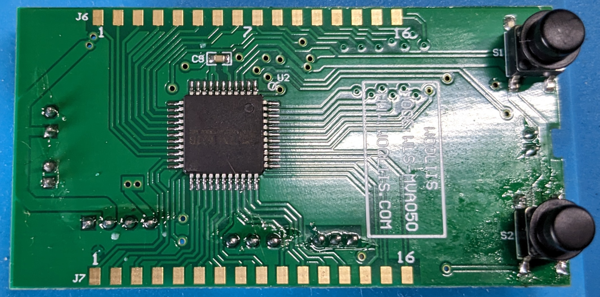
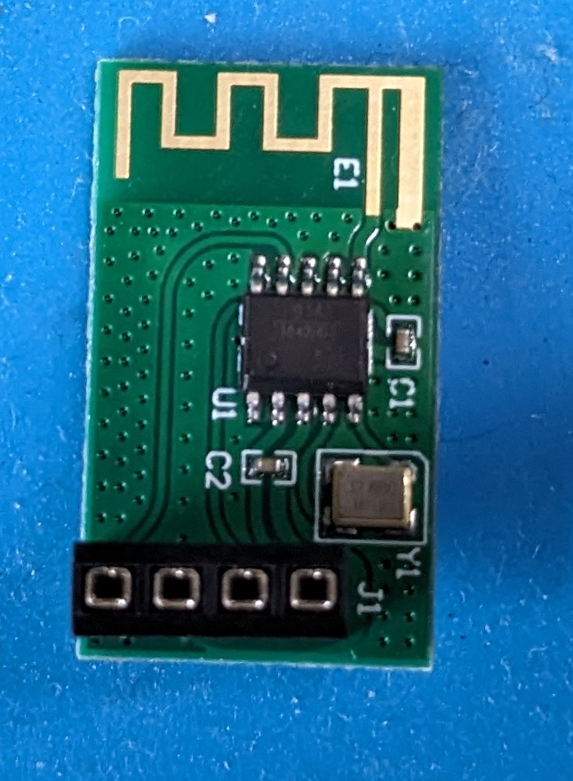

# Bluetooth Energy Monitor client
This is the result of my investigations into the WLS-MVAxxx battery monitor devices. They have a Bluetooth interface, which is provided by a [CH9141K](https://www.wch-ic.com/products/CH9141.html) Bluetooth to serial bridge.

## Scripts
So far the result are two python scripts

### sensor.py
This is an emulator of the protocol to test host software (and the original Android client) against, written in MicroPython. It should run on a Bluetooth capable controller of your choice, I'm using an Wemos D1 Mini ESP32 – ESP-WROOM board.

Run it in Thonny, and it should print messages to the console. Received messages start with 0xA55A, sent messages start with 0xB55B. It'll appear as a device called "esp32-energy" in the Android WBMS app.

It requires [aioble](https://github.com/micropython/micropython-lib/tree/master/micropython/bluetooth/aioble), which can be installed with [mpremote](https://docs.micropython.org/en/latest/reference/mpremote.html).

### host.py
This is a simple command line client to read data and modify the configuration.

It requires [bleak](https://github.com/hbldh/bleak) for BLE.

## BTW, why does Bluetooth on Android require the "location" permission?
I was wondering about that. Scanning for Bluetooth devices could be used to estimate the user's position, by triangulating
against the signal strength and MAC of several devices, or against known devices. So while "normal" apps won't make actual use of this, it is there as a warning.

## Hardware notes:
|  |IC       |Description               |             |
|--|---------|--------------------------|-------------|
|U1|MS51FC0AE|8051 based microcontroller|Main board   |
|U2|TM1622   |LCD driver                |Main board   |
|U1|CH9141K  |UART to BLE bridge        |Daughterboard|

### Label

This is the label on the back of the device, translated with Google translate.

### Main board
Front view:

Back view:

The square chip on the back is a LCD driver.

### BLE daughterboard
Front view:

Back view:

The chip is a [CH9141K](https://www.wch-ic.com/products/CH9141.html) BLE to serial bridge. Only power, RXD and TXD are connected, so advanced features like the "AT" mode are not accesible by the main board.
